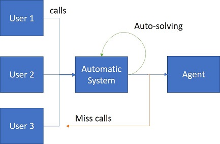

```{r libraries, message=FALSE, warning=FALSE, include=FALSE}
# import libraries to be used
library(tidyverse)
library(caret)
library(xts)
library(forecast)
library(lubridate)
library(reshape2)
library(quantmod)
library(TSA)
library(tsoutliers)
library(corrplot)
```

```{r data_import, message=FALSE, warning=FALSE, include=FALSE}
# importing train data from csv
data <- read.csv("data/train.csv", header = T)
```

# Challenge and variables description

## Problem

The number of agents available is crucial to the Contact Center success operation, where a low number of agents will lead to long waiting queues for the contacts and a high number will increase the operation cost by having agents doing nothing.

**The dataset corresponds to Contact Center metrics aggregated in 15 minutes intervals for a real Talkdesk client between 2017-01-01 and 2018-11-30 (23 months), and the competition goal is to forecast the number of agents for the days between 2018-12-01 and 2018-12-31 (1 month).**

## Features

The following information is provided with the data:

- *Interval* - the date and time corresponding to the contact center activity. This is given on a 15 min interval. 

### Events

During the initial presentation we learnt that talkdesk runs an "event" based operation. **A call is an event, and event triggers actions. The duration of each event is a restriction to the number of workers.** 

For each event information about quantity and duration is given:

- *Total Calls* - the number of calls. This represents the total amount of calls received during the time period. For example `r paste("between",data$interval[1],"and",data$interval[1],"this specific costumer received ", data$total_calls[1], "calls")`. 

- *Total Calls Duration* - the duration of a calls in seconds. This means `r paste("that on the", data$interval[1],"a total of",data$total_calls[1],"where received and took the total of",data$total_calls_duration[1], "seconds or in hours", data$total_calls_duration[1]/3600)`

- *Abandoned Calls* / *missing_calls*  - the number of calls that reach Talkdesk platform but hung up before it was answered by an agent. No further information regarding the reason why the call was missed is given. This may or may not impact the solution. For example, if miss calls are due to all operators being occupied, then, in order to maximize the service it may pay off the hire an extra worker.

> This feature raises the question of how long is an event. It makes sense that we take into account that one event requires a 1. setup time, an 2. execution time, a 3. after event task and probably a 4. cool down between events. 

### Workers

Being a service, "events" take time as raw material to be completed. This time is provided by workers which can supply a limited amount of it per day. The data provides us information regarding quantity for each time interval (headcount and available time) and how it is distributed by "tasks" or "status". 

From the information provided we can deduce that a worker can be at the following "status" at a given time, 1. Available, 2. Away, 3. Busy, 4. On a call, 5. After Call Work (ACW). Without further information we assume this are the only possible status and therefore the sum of all 5 should result on the total available time at a given time period.

- *Available Time* - agents time *online* and free to take a new call. During this time a task/event was not assigned to an agent. This is lazy time, therefore the smaller the better.

- *Away Time* - agents time *online* and away from the computer unable to receive a new call. It includes non productive chargable time. This time the agent is "active" but "unavailble". He/she could be away at the bathroom, having a coffee breake etc. Althought the minimum the better we consider this time to be a necessity and therefore given data to be taken into consideration.

- *Busy Time* - agents time online and busy with tasks or meetings not related to handling calls. That means admin time and non billable.

- *On a Call Time* - agents time online and handling (talking) with a contact

- *After Call Work Time* - agents time online and closing the contact interaction, for example, update ticket status on CRM systems

- *Total Handle Time* - total agents time from the point a call is answered until after the agent closes the contact interaction. This is the sum of "On a call Time" and "After Call work time"

> Total billable time = Total Handle Time
> Total non billable time = Available Time + Away Time + Busy Time
> Where the non billable is a consequence of either lack of events (Available time), admin tasks (busy time) or temporary unavailability

 *Agent Headcount* - total staff count for the interval (target). **side note: given the information this might represent the average head count**

### Metrics

The data provided already includs some metrics used by talkdesk 

- *Occupancy Rate* - agents time in an available status or handling a contact divided by the total agents time. we can extract the total agent time from this ratio.
- *Utilization Rate* - agents time actually handling interactions divided by the total agents time
- *Shrinkage Rate* - agents time occupied with not-handling interactions related tasks divided by the total agents time. This means *Busy and away time divided by available time*. The available but not assigned is not included.

[link to competition](https://www.kaggle.com/c/kdm-porto-2019/data)

# Data consistency

```{r consistency, include=FALSE}
consistency <- data %>% 
  mutate(numberAgents_NoCalls = round(total_calls_duration/(15*60)),
         agentsAvailableTime = agent_headcount*15*60,
         totalUsedTime = available_time + away_time + busy_time + total_handle_time,
         diff = totalUsedTime - agentsAvailableTime,
         underlyingTimeRatios = total_handle_time/(utilization_rate/100),
         interval = as.POSIXct(strptime(interval,"%Y-%m-%d %H:%M:%S"), tz = "UTC")) 
```

With the above feature definition lets make some consistency checks, mainly focusing on the amount of time available and used. For this a new table was created with the following values:

- *numberAgents_NoCalls*: given the total calls duration in seconds, if all available time was call time, how many agents would be needed. This result does not take into consideration the after call work time (ACW) and is calculating by diving the total_calls_duration by 900 seconds (the number of seconds by each period).

- *agentsAvailableTime*: considering the headcount for each time stamp the expected total available time that can be devoted to each status (taking into consideration that only total_handle_time is actualy time devoted to an event). This is calculated by agent_headcount * 900.

- *totalUsedTime*: sum of all time devolted to status. In theory this should be equal or lower than agentsAvailableTime.

- *diff*: difference between total used time and agents available time

- *underlyingTimeRatios*: considering the ratios given, which is the total number of hours used.


```{r agentCount_optimalAgents_plot, echo=FALSE, message=FALSE, warning=FALSE}
melt(select(consistency, numberAgents_NoCalls,agent_headcount)) %>% 
  ggplot(aes(x = value, fill = variable)) +
  geom_density(alpha=0.25) +
  labs(x = "count", title = "Agent headcount and Optimal number of agents")
```

By plotting both agent headcount and optimal agent head count density together we notice the existence of extrem values which are definitely outliers. This outliers result from the numberAgents_NoCalls. This is a strange result, lets look at all observations where the expectation surpasses the average headcount.

```{r headcount_outlier, echo=FALSE, message=FALSE, warning=FALSE}
consistency %>% 
  filter(numberAgents_NoCalls > max(agent_headcount)) %>% 
  arrange(desc(numberAgents_NoCalls)) %>% 
  select(interval, agent_headcount, numberAgents_NoCalls,total_calls,total_calls_duration,total_handle_time,totalUsedTime) %>% 
  knitr::kable(format.args = list(big.mark = ".", decimal.mark = ","))
```

From the table above some additional assumptions can be made about the business. Although 03-09-2018 clearly seems like an outlier situations when the service received an abnormal high frequency of calls (eg: suppose that the costumer is a comunication company, this could be resulting from a unexpected service shutdown) the total handle time is actual way below the total call duration. In fact during this time most agents where ocupied on busy status. This may by due to a meeting to share information about the situation.

In order for such a difference between the available time and the call duration exits that means that the call process includes some form of automatic reply which picks up before an agent. Given this assumptions, missing calls would represent calls which would be normally directed to an agent but where hanged up before it reaches one. (eg: an option to talk to an agent of a bank service).

**This means, that the number of agents is not only influenced by the number of calls but by their option/probability that they are passed by to an agent.**



```{r density_headcount, echo=FALSE}
consistency %>% 
  ggplot(aes(x = agent_headcount)) +
  geom_density() +
  geom_vline(aes(xintercept=mean(agent_headcount)),
            color="blue", linetype="dashed", size=1) +
  geom_vline(aes(xintercept=median(agent_headcount)),
            color="red", linetype="dashed", size=1)

```

Ploting the distribution of agents we notice that it is heavely skwed to the left with higher concentration towards zero. Once again we weren't expecting this results. At best, we would expect it to follow a normal distribution. **This result may signal the existence of seasonality.**

As an example we notice that `r scales::percent(nrow(data %>% filter(agent_headcount == 0))/nrow(data))` of the observations there were no agent available. A possible explanation is **that the call center is not continously open.**

Based on the information given we can safely assume that no "ring time" is included on this database. This means that the timer which was used to measure calls times starts when the call is pickedup either by an agent or an answering machine.

```{r echo=FALSE}
consistency %>% 
  group_by(date = as.Date(interval)) %>% 
  summarise(total_diff = sum(diff)/(60*60)) %>% 
  ggplot(aes(x = date, y = total_diff)) + 
  geom_line() +
  labs(title = "Daily difference between available working time and used time")
```

```{r echo=FALSE}
consistency %>% 
  group_by(date = as.Date(interval)) %>% 
  summarise(total_diff = sum(diff)/sum(agentsAvailableTime)) %>% 
  ggplot(aes(x = date, y = total_diff)) + 
  facet_wrap(year(date)~.,nrow = 2, scales = "free_x") +
  geom_line() +
  scale_y_continuous(labels = scales::percent) +
  geom_hline(aes(yintercept = median(total_diff)), color = "red")+
  labs(title = "Daily difference between available working time and used time", y="", x="")
```

```{r eval=FALSE, include=FALSE}
# TODO: Try to understand why there is such a difference between the agent available time and time used. In 2018 it almost reaches 2000 hours a day!!
```

# Individual variables

## Completeness and outliers

In order to explore the data at a variable level we start by studying its completeness and the existence of outliers. From the table below we conclude that the data is complete and that all observations are available. This further provides us with an important information, considering that we are dealing with a time series we can conclude that the series is **evenly spaced with time intervals of 15 minutes and can be treated as a discrete time series.** 

```{r missing_infinite_values, echo=FALSE}
data.frame(infinite = sapply(select(data,-interval),FUN = function(x){sum(is.infinite(x))}),
           missing_values = sapply(select(data,-interval),FUN = function(x){sum(is.na(x))})) %>% knitr::kable(caption = "Total missing and infinite observations per variable")
```

In order to identify potential sources of outliers we will boxplot each variable on a monthly basis. Some daily and weekly seasonality might be expected and for now we are not taking it into account and that can result on observations to show outside the "whiskers". For now we are focusing on very pornounced outlier values and expect that if they are due to any form of seasonality to be consistent over time.

```{r variables_boxplot, echo=FALSE, message=FALSE, warning=FALSE}
# converts interval into a date class
data <- data %>% mutate(interval = as.POSIXct(strptime(interval,"%Y-%m-%d %H:%M:%S"), tz = "UTC"))

# plots monthly boxplots
for (var in names(data[,-1])) {
  
  plot <- ggplot(data, aes(x = as.character(month(interval)), y = data[,var])) + 
    geom_boxplot() + 
    facet_grid(.~year(interval)) +
    ylab(var) +
    xlab("Months")
  
  print(plot)

}
```

### Total calls

The monthly box plots show a clear spike in September of both year of our data which are specialy relevant at September 2018.

```{r total_calls_august _october, echo=FALSE, message=FALSE, warning=FALSE}
data %>%
  filter(between(month(interval),8,10)) %>%  
  ggplot(aes(x = as.Date(interval), y = total_calls)) + 
  geom_line() + 
  facet_wrap(.~year(interval), nrow = 2, scales = "free_x") + 
  labs(title = "Total calls between August and October", x = "")
```

```{r calls_outliers_tukeys, echo=FALSE, message=FALSE, warning=FALSE}
data %>%
  filter(month(interval) == 9) %>%  
  ggplot(aes(x = interval, y = total_calls)) + 
  geom_line() + 
  facet_wrap(.~year(interval), nrow = 2, scales = "free_x") + 
  labs(title = "Total calls September (with tukeys fences)", x = "") +
  geom_hline(aes(yintercept = mean(total_calls)), color = "orange", linetype = "dashed", size = 0.7) +
  geom_hline(aes(yintercept = as.numeric(quantile(total_calls,0.25))+1.5 * IQR(total_calls)), color = "blue", linetype = "dashed", size = 0.7) + 
  geom_hline(aes(yintercept = as.numeric(quantile(total_calls,0.25))+ 3 * IQR(total_calls)), color = "red", linetype = "dashed", size = 0.7)

```

Plotting the closer months and Septembers distribution we conclude that there is a spike both around 25th of September 2017 and the 3rd of September 2018. Despite coincide on the same month, the available information does not allow for us to drive any conclusion. It might very well be an event that happens seasonaly (for example a summer sales) or just some random event. Given the spike size, specially on 2018, it may affect forecast and therefore we deal with this outlier during modeling.

```{r eval=FALSE, include=FALSE}
# TODO: remove outliers on total_calls that happen on sptember year 2017 and 2018
```


### Total calls duration

Given that this variable is the sum of each call (independent of answered by an agent or automatic) is not a surprise that we find similar spikes to the ones seen on total calls. Given the spike in September we will focus ou analysis on that time period.

```{r duration_september _october, echo=FALSE, message=FALSE, warning=FALSE}
data %>%
  filter(between(month(interval),8,10)) %>%  
  ggplot(aes(x = as.Date(interval), y = total_calls_duration)) + 
  geom_line() + 
  facet_wrap(.~year(interval), nrow = 2, scales = "free_x") + 
  labs(title = "Calls duration between August and October", x = "")
```

```{r duration_outliers_tukeys, echo=FALSE, message=FALSE, warning=FALSE}
data %>%
  filter(month(interval) == 9) %>%  
  ggplot(aes(x = interval, y = total_calls_duration)) + 
  geom_line() + 
  facet_wrap(.~year(interval), nrow = 2, scales = "free_x") + 
  labs(title = "Duration September (with tukeys fences)", x = "") +
  geom_hline(aes(yintercept = mean(total_calls_duration)), color = "orange", linetype = "dashed", size = 0.7) +
  geom_hline(aes(yintercept = as.numeric(quantile(total_calls_duration,0.25))+1.5 * IQR(total_calls_duration)), color = "blue", linetype = "dashed", size = 0.7) + 
  geom_hline(aes(yintercept = as.numeric(quantile(total_calls_duration,0.25))+ 3 * IQR(total_calls_duration)), color = "red", linetype = "dashed", size = 0.7)
```

Once again we don't detect any trend on periods around the spike which let us to conclude that is a random event which we will remove during modeling. We notice that despite the results we got for total calls we don't detect significant outliers on 2017.

```{r eval=FALSE, include=FALSE}
# TODO: deal with calls duration outliers during model, specially for September 2018
```

### Missing calls

From the boxplots we can notice that after june 2017, outlier events, meanning abnormaly high volume of missing calls increases and are more common than before. Recaping that this variable counts the number of calls that have been assigned to agents but the caller hanged up before it was picked up. **We can especulate about the reasons that led to such behaviour but one possible explanation is the increase volume of calls and the lack of available agents which leads to an increase on pickup time. This assumption might be relevant while modeling.** 

```{r 2017_missing_calls, echo=FALSE}
data %>%
  filter(year(interval) == 2017) %>% 
  ggplot(aes(x = day(interval), y = missing_calls)) +
  geom_line() + 
  facet_wrap(.~month(interval),ncol = 3, scales = "free") + 
  labs(title = "Monthly missing calls (with tukeys fences)", x = "", y = "2017") +
  geom_hline(aes(yintercept = median(missing_calls)), color = "orange", linetype = "dashed", size = 0.7) +
  geom_hline(aes(yintercept = as.numeric(quantile(missing_calls,0.25))+1.5 * IQR(missing_calls)), color = "blue", linetype = "dashed", size = 0.7) + 
  geom_hline(aes(yintercept = as.numeric(quantile(missing_calls,0.25))+ 3 * IQR(missing_calls)), color = "red", linetype = "dashed", size = 0.7)

```

```{r 2018_missing_calls, echo=FALSE}
data %>%
  filter(year(interval) == 2018) %>% 
  ggplot(aes(x = day(interval), y = missing_calls)) +
  geom_line() + 
  facet_wrap(.~month(interval),ncol = 3, scales = "free") + 
  labs(title = "Monthly missing calls (with tukeys fences)", x = "", y = "2018") +
  geom_hline(aes(yintercept = median(missing_calls)), color = "orange", linetype = "dashed", size = 0.7) +
  geom_hline(aes(yintercept = as.numeric(quantile(missing_calls,0.25))+1.5 * IQR(missing_calls)), color = "blue", linetype = "dashed", size = 0.7) + 
  geom_hline(aes(yintercept = as.numeric(quantile(missing_calls,0.25))+ 3 * IQR(missing_calls)), color = "red", linetype = "dashed", size = 0.7)
```

As expected by the nature of this variable, the monthly median is low and closer to zero sugesting that most of the times there are no missing calls and the agents can handle them. In this context, any spike returns as an outlier. Given its nature there is no need to clean this variable because being an outlier is part of its nature.

**From the plots we denote a trend of increasing missing calls as calls volume increase.**

```{r eval=FALSE, include=FALSE}
# TODO: Study relation between call volume, missing calls & agents usage (probably linear)
```

### Available time

With the help of the boxplot we identify sudden spike on available time at November 2017 and January 2018.

```{r available_time_novjan, echo=FALSE, message=FALSE, warning=FALSE}
data %>%
  filter(month(interval) == 11 & year(interval) == 2017 |
          month(interval) == 1 & year(interval) == 2018 ) %>%  
  ggplot(aes(x = as.Date(interval), y = available_time/(60*60))) + 
  geom_line() + 
  facet_wrap(.~year(interval), nrow = 2, scales = "free") + 
   geom_hline(aes(yintercept = median(available_time/(60*60))), color = "red", linetype = "dashed", size = 0.7) +
  labs(title = "Available time - outlier months", x = "", y = "available time (hours)")
```

```{r max_available time, echo=FALSE}

data %>% 
  filter(year(interval) == 2017) %>%
  filter(available_time == max(available_time)) %>% 
  rbind(
     data %>% 
  filter(year(interval) == 2018) %>%
  filter(available_time == max(available_time))
  )

```
Both spikes on available time seem to happen randomly during a 15 minute interval and are inconsistent with agent headcount. For example, on November 2017 a total of `r data %>% filter(available_time == max(available_time)) %>% pull(agent_headcount)` had a total of `r data %>% filter(available_time == max(available_time)) %>% pull(available_time)` on a 15 min time block which is clearly impossible. 

With the information given is not possibel to draw any conclusions about the reasons behind this outliers. We can especulate that probabily they result from a input errror. Given its impact on average values we will substitute this value during modeling.

```{r eval=FALSE, include=FALSE}
# TODO: Deal with available time outliers 
```

### Away time

```{r away time nov 2018, echo=FALSE, message=FALSE, warning=FALSE}
data %>%
  filter(month(interval) == 11 & year(interval) == 2018) %>%  
  ggplot(aes(x = interval, y = away_time/(60*60))) + 
  geom_line() + 
  geom_hline(aes(yintercept = mean(away_time/(60*60))), color = "red", linetype = "dashed", size = 0.7) +
  labs(title = "Away time November 2018", x = "", y = "away time (hours)")
```

Because away time is often zero or closer to zero, the mean value is low making higher values.

Given the distribution there is no need to change outliers.

### Busy time

From the box plot we noticed the existence of an extrem value in July.

```{r busy time june 2018, echo=FALSE, message=FALSE, warning=FALSE}
data %>%
  filter(month(interval) == 7 & year(interval) == 2018) %>%  
  ggplot(aes(x = interval, y = busy_time/(60*60))) + 
  geom_line() + 
  geom_hline(aes(yintercept = mean(busy_time/(60*60))), color = "red", linetype = "dashed", size = 0.7) +
  labs(title = "Busy time June 2018", x = "", y = "away time (hours)")
```

Using a one month scatter plot we notice a pick around day 26. By plotting the surrounding days its clear how big is the outlier. This may be due to some corporate event and therefore we won't change any value.

```{r busy_26, echo=FALSE}
data %>%
  filter(month(interval) == 7 & year(interval) == 2018 & day(interval) %in% c(25,26,27)) %>%  
  ggplot(aes(x = interval, y = busy_time/(60*60))) + 
  geom_point() + 
  geom_line() +
  facet_wrap(.~day(interval), nrow = 3, scales = "free_x") +
  labs(title = "Busy time 25th, 26th, 27th of june", x = "", y = "away time (hours)")

```

```{r busy_27, echo=FALSE}
data %>% 
  filter(busy_time == max(busy_time)) %>% 
  mutate(infered_time = total_handle_time/(utilization_rate/100)) %>% 
  select(-missing_calls,-occupancy_rate,-shrinkage_rate,-total_calls,-utilization_rate, -agent_headcount) %>% 
  gather("var","value", - interval) %>% 
  ggplot(aes(x = "", y = reorder(value, -table(value)[value]) , fill = var )) +
  geom_bar(position = "dodge",stat ="identity") + 
  labs(x ="",title = "Time slit on the 27th of July")+
  theme_bw()
```

```{r eval=FALSE, include=FALSE}
# TODO: rething inpacts of outliers
```

## Relationship among variables

```{r ts_creation, warning=TRUE, include=FALSE}
# Converts data into xts class for time series manipulation
xts_data <- as.xts(x = select(data,-interval), order.by = as.POSIXct(strptime(data$interval,"%Y-%m-%d %H:%M:%S"), tz = "UTC"))

# Class ts with different frequency
ts_data <- ts(select(data,-interval),frequency = 96)

# Class msts with multiseaonability
msts_data <- msts(select(data,-interval),seasonal.periods = c(96,96*7,96*31))

# Creating end points to be used on plots
ep_quarters <- endpoints(xts_data,on="quarters")
ep_months <- endpoints(xts_data,on="months") 
ep_weeks <- endpoints(xts_data,on="weeks") 
ep_days <- endpoints(xts_data,on="days") 
ep_hours <- endpoints(xts_data,on="hours") 
```


```{r}
plot.zoo(xts_data[,c("total_calls","away_time")],plot.type = "multiple")
```


### About events

We have said before that talkdesk is an event based service, being calls an event. Our database provides us the following information about this events:

1. total number of calls
2. total duration of this calls
3. total missing calls

```{r echo=FALSE}
#period.apply applies a function over a specific time moment (similar to apply)

plot(period.apply(xts_data[,c("total_calls","missing_calls")], 
                  on = "quartes",
                  INDEX = ep_quarters,
                  FUN = mean),
     type = "b", 
     xlab = "Total calls", 
     legend(c("total_calls","missing_calls")),
     legend.loc = "topleft",
     main = "Average quarterly total calls (amount)")
```

```{r echo=FALSE}
plot(period.apply(xts_data[,c("total_calls","missing_calls")], 
                  on = "months",
                  INDEX = ep_months,
                  FUN = mean),
     type = "b", 
     xlab = "Total calls", 
     legend(c("total_calls","missing_calls")),
     legend.loc = "topleft",
     main = "Average monthly total calls (amount)")
```

```{r echo=FALSE}
plot(period.apply(xts_data[,c("total_calls","missing_calls")], 
                  on = "weeks",
                  INDEX = ep_weeks,
                  FUN = mean),
     type = "l", 
     xlab = "Total calls", 
     legend(c("total_calls","missing_calls")),
     legend.loc = "topleft",
     main = "Average weekly total calls (amount)")
```

```{r echo=FALSE}
plot(period.apply(xts_data[,c("total_calls","missing_calls")], 
                  on = "days",
                  INDEX = ep_days,
                  FUN = mean),
     type = "l", 
     xlab = "Total calls", 
     legend(c("total_calls","missing_calls")),
     legend.loc = "topleft",
     main = "Average daily total calls (amount)")
```

```{r eval=FALSE, include=FALSE}
# TODO: Comparar evolução média durante dias da semana e fim de semanas
```

```{r}
# par(mfrow =c(2,1))
t <- xts_data
t$call_bigger_duration <- ifelse(t$total_calls_duration < t$on_a_call_time, 1,0)

plot.xts(period.apply(t[,"call_bigger_duration"], 
                  on = "days",
                  INDEX = ep_days,
                  FUN = mean),
     type = "l", 
     xlab = "Total calls", 
     legend(c("total_calls","missing_calls")),
     legend.loc = "topleft",
     main = "Average daily total calls (amount)")

nov_2018_xts = xts_data["2017-04-20"]
plot.zoo(nov_2018_xts[,c("total_calls_duration","on_a_call_time")],plot.type = "multiple", lty = c(1,2),lwd = c(1,2))
```

```{r}

```


We expect total calls and its duration to be instrumental to find the right solutions. The total agent headcount depends on the amount of expected work which is triggered by the existence of events, in this case, calls.

**Plotting both the total number of calls and missing calls we  notice a positive trend in time. That trend is not fully followed by missing calls which stay relatively flat during the period. Another noticible conclusion is that the variance increases with time and that the data is seasonal.**

Given that data is presented to us with 15 min time interval a daily seasonality was expected.

```{r}
autoplot(
  diff(xts_data$total_calls, lag = 96)[which(
    diff(xts_data$total_calls, lag = 96)$total_calls >= as.numeric(quantile(xts_data$total_calls,0.25))-1.5 * IQR(xts_data$total_calls) & diff(xts_data$total_calls, lag = 96)$total_calls <= as.numeric(quantile(xts_data$total_calls,0.75))+1.5 * IQR(xts_data$total_calls)
    ),]
  )
```

```{r}
Box.test(xts_data$total_calls, lag = 96, fitdf = 0, type = "Lj")
```


```{r acf_total_calls, echo=FALSE}
ggAcf(xts_data$total_calls,plot = TRUE, lag.max = 96)
```

```{r total_calls_decompose, echo=FALSE}
ts_data[,"total_calls"] %>% 
  tail(96*31) %>% 
  tsclean() %>% 
  decompose() %>% 
  autoplot()
```

The above plots clearly display a daily seasonality as weel as weekly. By plotting quarterly and monthly we haven't identify any source of seasonality.

```{r msts_total_calls_decompose, echo=FALSE}
msts_data[,"total_calls"] %>% 
  tail(96*31*6) %>% 
  tsclean() %>% 
  mstl() %>% 
  autoplot()
```

Lets now focus on the duration of this calls. In order to isolate the effect of increase number of calls we focus on call duration and search for a trend.

```{r avg_call_duration, include=FALSE}

calls <- as.data.frame(xts_data) %>%  
  mutate(avg_call_duration =ifelse(is.na(total_calls_duration/total_calls),0,total_calls_duration/total_calls)) %>% 
  as.xts(order.by = as.POSIXct(strptime(rownames(as.data.frame(xts_data)),"%Y-%m-%d %H:%M:%S"), tz = "UTC"))

```

```{r average_duration vs total calls, echo=FALSE}
plot(period.apply(calls[,c("total_calls","avg_call_duration")], 
                  on = "month",
                  INDEX = ep_months,
                  FUN = mean),
     type = "b", 
     xlab = "months", 
     legend(c("total_calls","avg_calls_duration")),
     legend.loc = "topleft",
     main = "Average monthly calls amount and duration")
```

```{r daily call duration, echo=FALSE}
plot(period.apply(calls[,c("total_calls","avg_call_duration")], 
                  on = "daily",
                  INDEX = ep_days,
                  FUN = mean),
     type = "l", 
     xlab = "days", 
     legend(c("total_calls","avg_calls_duration")),
     legend.loc = "topleft",
     main = "Average daily calls amount and duration")
```

We notice that average call duration falls a positive trend as total calls, but at a lower slope.

```{r total_calls vs duration, echo=FALSE}
as.data.frame(calls) %>% 
  filter(avg_call_duration > as.numeric(quantile(avg_call_duration,0.25)) -  1.5 * IQR(avg_call_duration) & avg_call_duration < as.numeric(quantile(avg_call_duration,0.75)) +  1.5 * IQR(avg_call_duration)) %>% 
  ggplot(aes(x = total_calls , y = avg_call_duration)) + 
  geom_point() +
  labs(title = "Total calls average duration relation")
```

The scatter plot above further shows the lack of relationship between the total number of calls and its average duration.

```{r echo=FALSE}
plot.zoo(calls$avg_call_duration["2017-09-15"], type = "l") 
abline(h = mean(calls$avg_call_duration["2017-09-15"]), col = "blue")
```

```{r echo=FALSE}
plot.zoo(calls$avg_call_duration["2018-09-15"], type = "l") 
abline(h = mean(calls$avg_call_duration["2018-09-15"]), col = "blue")
```

Looking at 2 random days on both years we notice that despite a small drop arround 10 o´clock it surrounds the mena vlaue

```{r}
msts_calls <- msts(calls, seasonal.periods = c(96,96*7,96*31,96*31*6))

msts_calls[,"avg_call_duration"] %>% 
  #tail(96*31*6) %>% 
  tsclean() %>% 
  mstl() %>% 
  autoplot()
```

Decomposing the trends we notice the existence of daily weekly, monthly and semester trends.

```{r eval=FALSE, include=FALSE}
# TODO: Aplicar modelo de previsão ao nº de chamadas e ao nº médio da duração de chamadas.
```

### Agents headcount

```{r echo=FALSE}
# convert to time base
to.monthly(xts_data$agent_headcount) %>% chart_Series(multi.col=TRUE, TA = NULL)
```

```{r}
plot(period.apply(xts_data[,c("total_calls","agent_headcount")], 
                  on = "month",
                  INDEX = ep_months,
                  FUN = mean),
     type = "b", 
     xlab = "months", 
     legend(c("total_calls","agent_headcount")),
     legend.loc = "topleft",
     main = "Average monthly calls and agents")
```

```{r echo=FALSE}
as.data.frame(xts_data) %>% 
  filter(total_calls > as.numeric(quantile(total_calls,0.25)) -  1.5 * IQR(total_calls) & total_calls < as.numeric(quantile(total_calls,0.75)) +  1.5 * IQR(total_calls)) %>% 
  ggplot(aes(x = total_calls , y = agent_headcount)) + 
  geom_point() +
  geom_smooth(method = "lm") +
  labs(title = "Total calls headcount relation")
```


```{r echo=FALSE}
as.data.frame(xts_data) %>% 
  filter(total_calls_duration > as.numeric(quantile(total_calls_duration,0.25)) -  1.5 * IQR(total_calls_duration) & total_calls_duration < as.numeric(quantile(total_calls_duration,0.75)) +  1.5 * IQR(total_calls_duration)) %>% 
  ggplot(aes(x = total_calls_duration , y = agent_headcount)) + 
  geom_point() +
  geom_smooth(formula = y ~ poly(x,5, raw = TRUE),method = "lm") +
  labs(title = "Total calls duration headcount relation") + 
  annotate("text",x = 80000,y = 1,label = paste0("R^2 == ",summary(lm(agent_headcount ~ poly(total_calls_duration, 8, raw = TRUE), data = xts_data))$adj.r.squared), parse =TRUE)
```

```{r}
corr <- cor(xts_data) %>% corrplot::corrplot(method = "number", tl.srt=45)
```

```{r}
# mat : is a matrix of data
# ... : further arguments to pass to the native R cor.test function
cor.mtest <- function(mat, ...) {
    mat <- as.matrix(mat)
    n <- ncol(mat)
    p.mat<- matrix(NA, n, n)
    diag(p.mat) <- 0
    for (i in 1:(n - 1)) {
        for (j in (i + 1):n) {
            tmp <- cor.test(mat[, i], mat[, j], ...)
            p.mat[i, j] <- p.mat[j, i] <- tmp$p.value
        }
    }
  colnames(p.mat) <- rownames(p.mat) <- colnames(mat)
  p.mat
}
# matrix of the p-value of the correlation
p.mat <- cor.mtest(xts_data)

corr <- cor(xts_data) %>% corrplot::corrplot(method = "number", tl.srt=45, p.mat = p.mat, sig.level = 0.05)
```

```{r}
as.data.frame(xts_data) %>% 
  filter(total_calls > as.numeric(quantile(total_calls,0.25)) -  1.5 * IQR(total_calls) & total_calls < as.numeric(quantile(total_calls,0.75)) +  1.5 * IQR(total_calls)) %>% 
  ggplot(aes(x = total_calls , y = agent_headcount)) + 
  geom_point() +
  geom_smooth(formula = y ~ poly(x, 5, raw = TRUE),method = "lm") +
  labs(title = "Total calls duration headcount relation") +

  annotate("text",x = 700,y = 1,label = paste0("R^2 == ",summary(lm(agent_headcount ~  poly(total_calls, 5, raw = TRUE), data = xts_data))$adj.r.squared), parse =TRUE)
```

```{r}
as.data.frame(xts_data) %>% 
  filter(away_time > as.numeric(quantile(away_time,0.25)) -  1.5 * IQR(away_time) & away_time < as.numeric(quantile(away_time,0.75)) +  1.5 * IQR(away_time)) %>% 
  ggplot(aes(x = away_time , y = agent_headcount)) + 
  geom_point() +
  geom_smooth(formula = y ~ poly(x, 5, raw = TRUE),method = "lm") +
  labs(title = "Total calls duration headcount relation") +

  annotate("text",x = 7000,y = 300,label = paste0("R^2 == ",summary(lm(agent_headcount ~  poly(away_time, 5, raw = TRUE), data = xts_data))$adj.r.squared), parse =TRUE)
```

```{r}
as.data.frame(xts_data) %>% 
  filter(busy_time > as.numeric(quantile(busy_time,0.25)) -  1.5 * IQR(busy_time) & busy_time < as.numeric(quantile(busy_time,0.75)) +  1.5 * IQR(busy_time)) %>% 
  ggplot(aes(x = busy_time , y = agent_headcount)) + 
  geom_point() +
  geom_smooth(formula = y ~ poly(x, 5, raw = TRUE),method = "lm") +
  labs(title = "Total calls duration headcount relation") +

  annotate("text",x = 7000,y = 300,label = paste0("R^2 == ",summary(lm(agent_headcount ~  poly(busy_time, 5, raw = TRUE), data = xts_data))$adj.r.squared), parse =TRUE)
```

```{r}
as.data.frame(xts_data) %>% 
  filter(on_a_call_time > as.numeric(quantile(on_a_call_time,0.25)) -  1.5 * IQR(on_a_call_time) & on_a_call_time < as.numeric(quantile(on_a_call_time,0.75)) +  1.5 * IQR(on_a_call_time)) %>% 
  ggplot(aes(x = on_a_call_time , y = agent_headcount)) + 
  geom_point() +
  geom_smooth(formula = y ~ poly(x, 5, raw = TRUE),method = "lm") +
  labs(title = "Total calls duration headcount relation") +

  annotate("text",x = 7000,y = 300,label = paste0("R^2 == ",summary(lm(agent_headcount ~  poly(on_a_call_time, 5, raw = TRUE), data = xts_data))$adj.r.squared), parse =TRUE)
```

```{r}
as.data.frame(xts_data) %>% 
  filter(total_handle_time > as.numeric(quantile(total_handle_time,0.25)) -  1.5 * IQR(total_handle_time) & total_handle_time < as.numeric(quantile(total_handle_time,0.75)) +  1.5 * IQR(total_handle_time)) %>% 
  ggplot(aes(x = total_handle_time , y = agent_headcount)) + 
  geom_point() +
  geom_smooth(formula = y ~ poly(x, 5, raw = TRUE),method = "lm") +
  labs(title = "Total calls duration headcount relation") +

  annotate("text",x = 7000,y = 300,label = paste0("R^2 == ",summary(lm(agent_headcount ~  poly(total_handle_time, 5, raw = TRUE), data = xts_data))$adj.r.squared), parse =TRUE)
```

```{r echo=FALSE}

set.seed(123)
partition <- createDataPartition(xts_data$agent_headcount, p = 0.8, list = FALSE)

train <- xts_data[partition,]
test <- xts_data[-partition,]

# test linear relationship
trainControl <- trainControl(method = "repeatedcv", 
                          number = 5,
                          repeats = 5,
                          verboseIter = TRUE)

model <- caret::train(form = agent_headcount ~ total_calls + total_handle_time + away_time + busy_time, 
                      data = train,
                      method = "gbm",
                      trControl = trainControl,
                      metric = "RMSE",
                      preProcess = c("center","scale"))

fit <- predict(model, test)
postResample(pred = fit,obs = test$agent_headcount)

```


```{r}
calls <- tsclean(xts_data$total_calls)
handle <- tsclean(xts_data$total_handle_time)
t <- merge(calls,handle,join = "inner")

as.data.frame(t) %>% 
  ggplot(aes(x = total_calls , y = total_handle_time)) + 
  geom_point() +

  geom_smooth(formula = y ~ poly(x, 3, raw = TRUE),method = "lm") +
  annotate("text",x = 800,y = 300,label = paste0("R^2 == ",summary(lm(total_handle_time ~  poly(total_calls,3,raw=TRUE), data = t))$adj.r.squared), parse =TRUE)
```


```{r}
set.seed(123)
partition <- createDataPartition(xts_data$agent_headcount, p = 0.8, list = FALSE)

train <- xts_data[partition,]
test <- xts_data[-partition,]

# test linear relationship
trainControl <- trainControl(method = "repeatedcv", 
                          number = 5,
                          repeats = 5,
                          verboseIter = TRUE)

model <- caret::train(form = total_handle_time ~ total_calls, 
                      data = train,
                      method = "gbm",
                      trControl = trainControl,
                      metric = "RMSE",
                      preProcess = c("center","scale"))

fit <- predict(model, test)
postResample(pred = fit,obs = test$total_handle_time)
```

```{r}
calls <- tsclean(xts_data$total_calls)
away <- tsclean(xts_data$away_time)
t <- merge(calls,away,join = "inner")

t %>%  
as.data.frame() %>% 
  ggplot(aes(x = total_calls , y = away_time)) + 
  geom_point() +
  geom_smooth(formula = y ~ x ,method = "lm") +
  annotate("text",x = 700,y = 300,label = paste0("R^2 == ",summary(lm(away_time ~  log(total_calls), data = xts_data))$adj.r.squared), parse =TRUE)
```

```{r}
set.seed(123)
partition <- createDataPartition(xts_data$agent_headcount, p = 0.8, list = FALSE)

train <- xts_data[partition,]
test <- xts_data[-partition,]

# test linear relationship
trainControl <- trainControl(method = "repeatedcv", 
                          number = 5,
                          repeats = 5,
                          verboseIter = TRUE)

model <- caret::train(form = away_time ~ total_calls, 
                      data = train,
                      method = "xgbLinear",
                      trControl = trainControl,
                      metric = "RMSE",
                      preProcess = c("center","scale"))

fit <- predict(model, test)
postResample(pred = fit,obs = test$away_time)
```

```{r}
plot(period.apply(xts_data[,"busy_time"]["2018-03-18/"],
                  INDEX = endpoints(xts_data["2018-03-18/"],on="days") ,
                  FUN = mean),
     type = "l", 
     xlab = "months", 
     main = "Average daily busytime")
```